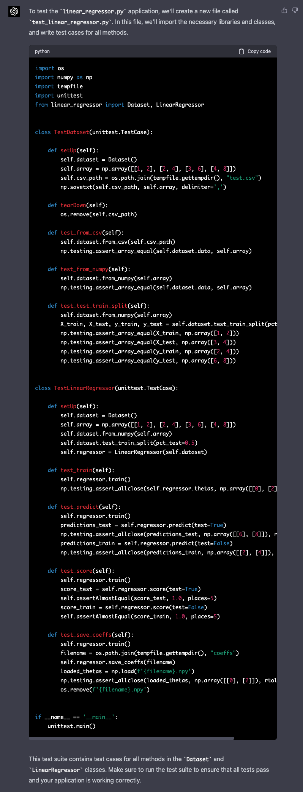
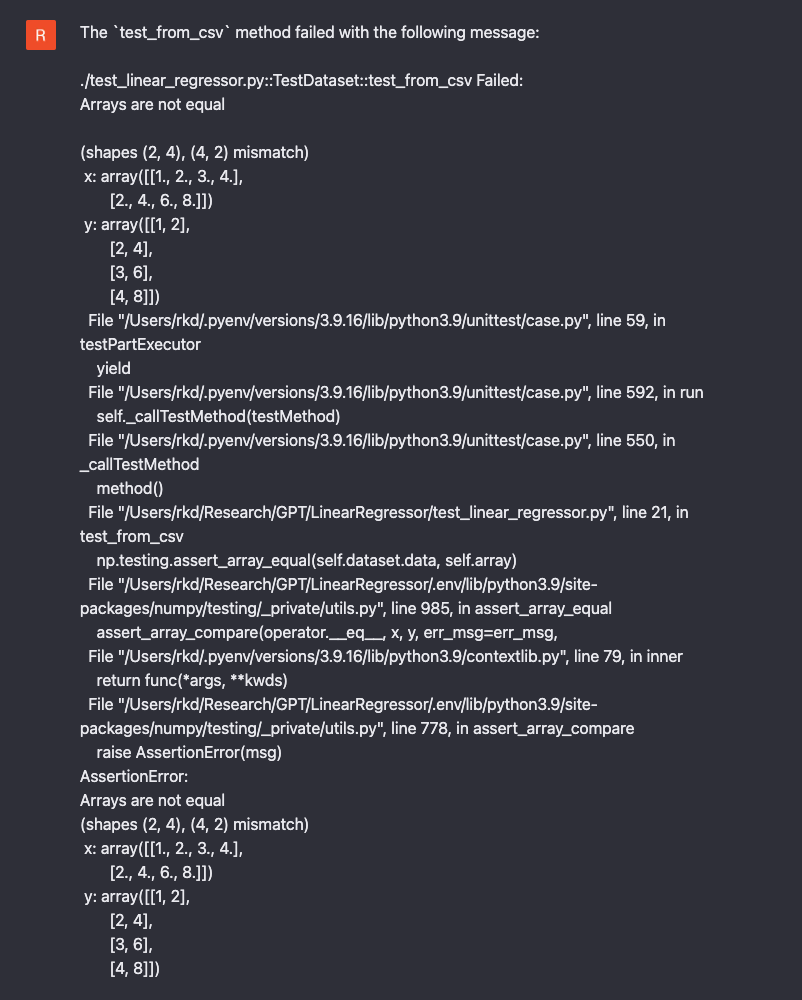
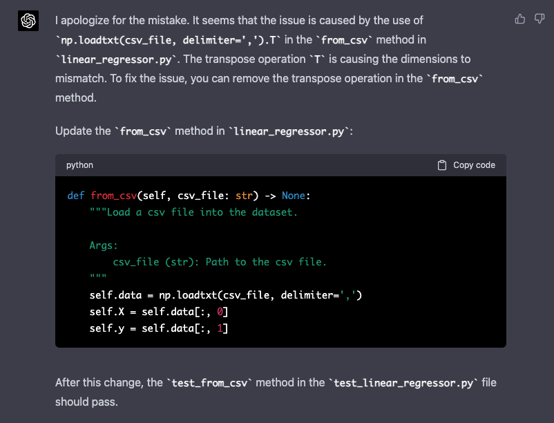
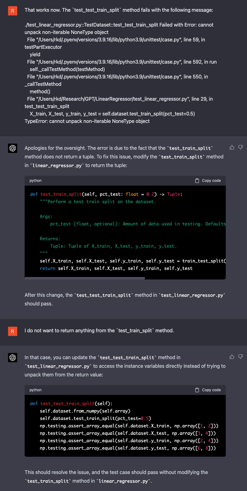
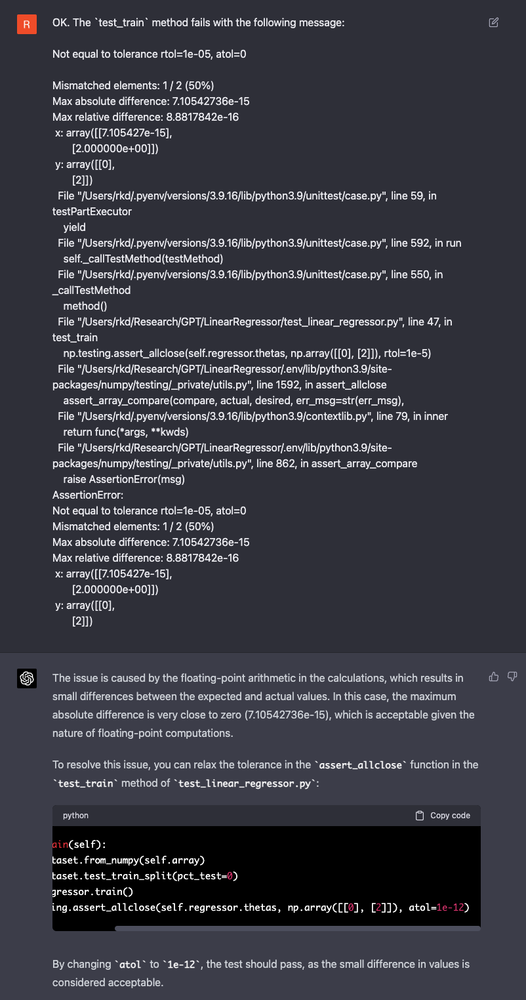
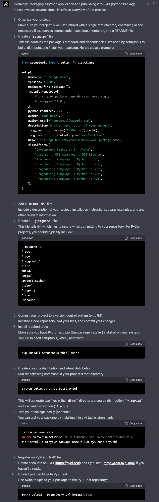
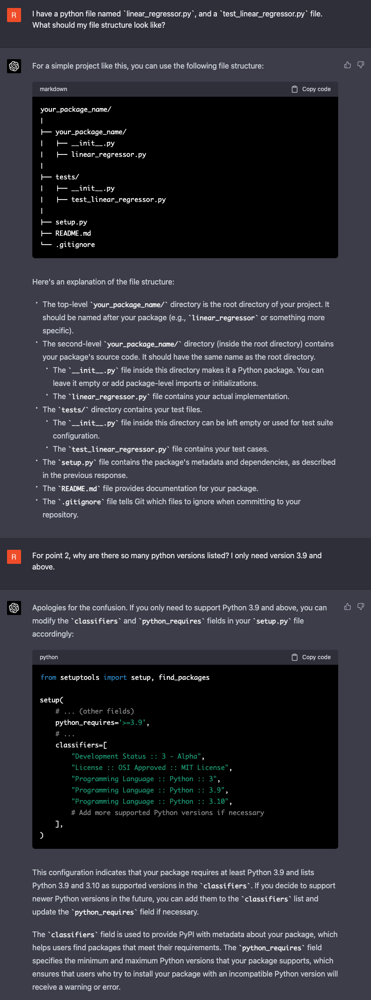
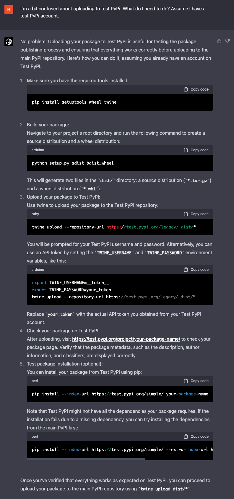

# Using GPT-4 to test and package python applications.

It's very common for researchers to develop an application (in python or whatever arcane language you prefer), and then import that application into a Jupyter notebook to perform their actual research on - exploratory analysis, plotting, etc. In this repo, you can see that we have a python file `linear_regressor.py`, and a Jupyter notebook `exploratory_analaysis.ipynb`. We are in essence "simulating" the research process. If you look at the initial commit, you can see that these two file were basically all that existed, plus perhaps a sample data file.

## Testing
Testing is an important part of maintaining a healthy codebase. It's also not particularly exciting and potentially a big time commitment. To try and save time, we gave GPT-4 the following prompt:

> You are a python testing expert. I would like you to help me write test cases for my Python application `linear_regressor.py`. Please write test cases for all methods. Here is the application:

...followed by everything in `linear_regressor.py`.

This is the output:

After making the changes, this throws an error:

GPT is quick to point out an error in the `from_csv` method (one that I had in fact not noticed...)

However, we also have an issue with the `test_train_split` method:

GPT tries to change my class method, but once it is informed that I don't want to return anything from my `test_train_split` method, it makes the necessary changes.

Finally, notice that in the `test_train` method, the absolute tolerance used is the default value of 0, so although the relative tolerance is within limits, the absolute tolerance causes the test to fail. GPT correctly identifies this issue, and adds a small atol, but neglects to include the rtol which would then become the default value of `1e-7`, which I suppose is fine.

## Packaging and Publishing
How are other researchers supposed to know how bad you are at programming if you don't publish your code? Don't worry, GPT-4 is pretty bad at it too.

> You are a python packing AI. I have a python application that I want to package. Can you give me an overview of how to package up my application so that I can publish it to PyPi.

The reply is impressively detailed:

Notice that GPT takes the `setup.py` route rather than a toml file. And uses and twine opting not to use something like Poetry, and also doesn't utilize the Build library. Is this the direction I would go? Probably not, but let's see if it works.

I want to find out more about how I need to structure my files:

This is how I would structure my package, and GPT gives handy information just as adding package-level imports into the `__init__.py` file.

I also asked it about the classifiers in the setup file, but GPT wasn't to know that I was using python 3.9 for this, and responds to my requests.

Next, I requested clarification on publishing to PyPi:

So after following this advice, my package actually uploaded correctly to Test PyPi, and I could install and use it in a separate environment.

Even if the approach used here is not exactly what you would do, it still works! This fact alone is frankly astonishing!